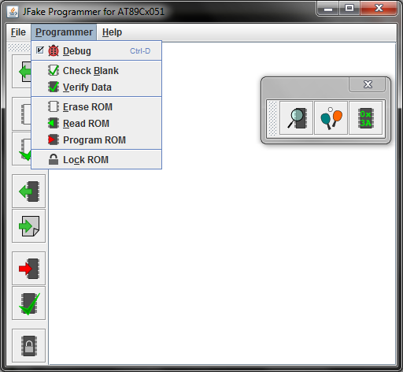

JFakeProgrammer
===============

Connection interface and GUI for a home-made AT89Cx051 programmer device
Licensed under the [GPL v3 License](http://www.gnu.org/licenses/gpl.html)

Uses the [nrjavaserial](https://code.google.com/p/nrjavaserial/) library (LGPL v2) for serial comunication,
Application purpose is simplifying communication with the programmer device via simple protocol. May be used
as source of examples for serial communication through the nrjavaserial or [RXTX library](http://rxtx.qbang.org/).
If you happen to have
our hardware device, launching the main class (org.jfakeprog.gui.JFakeProg) will give you a fully functional
graphic user interface for controling the programmer. Supported operations:
* program supported microcontrollers
* erase their memory
* verify program
* check erased state
* Lock memory against read and verification (NOT IMPLEMENTED YET)

_(Bad news: log messages and tooltip texts are still only in Bulgarian)_

Supported microcontrollers are AT89C4051 and AT89C2051. The programmer is a device of the same type itself. Firmware sources are available at [AFakeProgrammer](https://github.com/shadjiiski/AFakeProgrammer)

System requirements and Installation
====================================
all systems that have the JRE 1.7 installed will support the programmer. To install follow the steps:
* Download and unzip [latest release](JFakeProg/out/release.zip)
* For *nix users set execute flag to launcher.sh
* Double click the launcher

Screenshots
-----------

